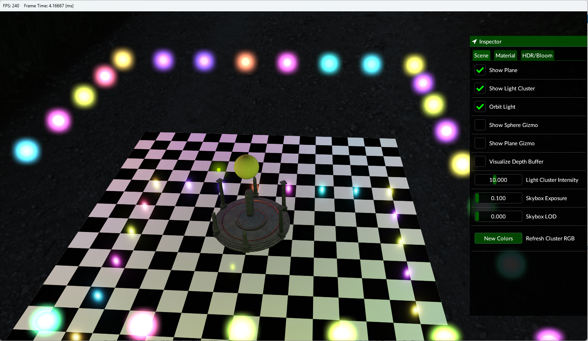
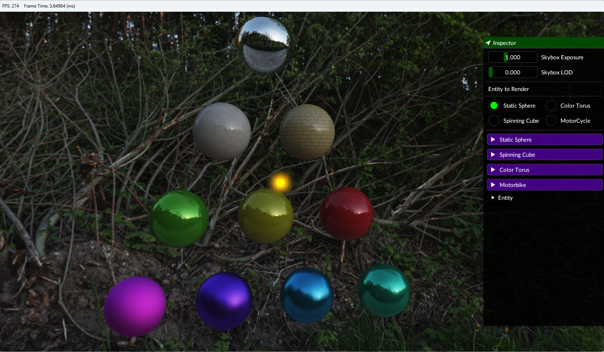
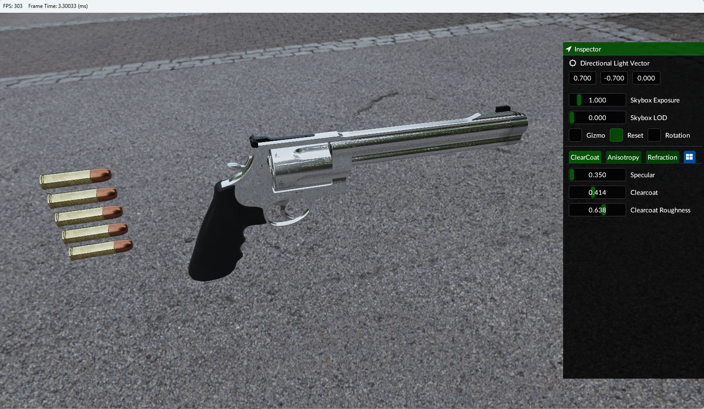
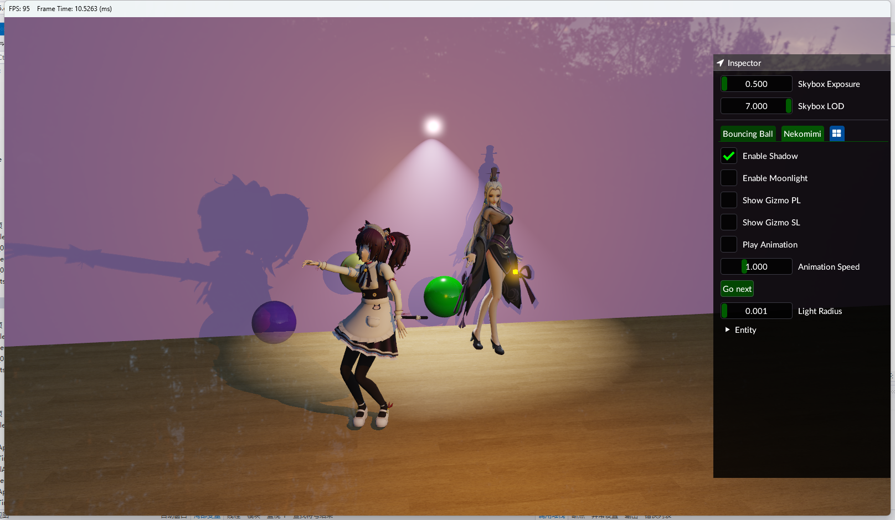

# opengl - physically-based renderer

This is a simple renderer built with OpenGL 4.6 and C++17 ,and this is inspired by **[sketchpad](https://github.com/neo-mashiro/sketchpad)**

## How to build (Windows only)

- Visual Studio 2019
- Windows 10/11 with OpenGl4.6 support
- Cmake

```
git clone https://github.com/271812697/opengl.git
cd opengl/
mkdir Build
cd Build/
cmake ..
```

## Screenshots










## Features

| Application                                     | Rendering                                           |
| ----------------------------------------------- | --------------------------------------------------- |
| manage objects with entity-component system     | tiled forward rendering (screen space)              |
| runtime scene loading and scene switching       | physically-based shading and image-based lighting   |
| skeleton animation for humanoid models          | physically-based materials (simplified Disney BSDF) |
| FPS camera with smooth zoom and arcball control | compute shader IBL baking                           |
| blazingly fast native screen capturing (GDI+)   | compute shader bloom effect                         |
| independent resource and asset managers         | compute shader cloth simulation                     |
| smart material system and viewable framebuffers | configurable wireframe rendering                    |
| smart OpenGL context switching                  | Blender-style infinite grid                         |
| automatic resolve `std140` layout               | off-screen MSAA                                     |
| support `#include` directives in GLSL           | omnidirectional PCSS shadows (Poisson disk)         |
| all shaders in one file (except compute shader) | runtime transformation control using Gizmos         |
| built-in clock and framerate counter            | tone mapping and gamma correction                   |
