# opengl renderer

This is a simple renderer built with OpenGL 4.6 and C++17 

Watch [demo](https://www.bilibili.com/video/BV18Y4y1973W/) on bilibili

## How to build (Windows only)

- Visual Studio 2019 or greater
- Windows 10/11 with OpenGl4.6 support
- Cmake

```
git clone https://github.com/271812697/opengl.git
cd opengl/
mkdir Build
cd Build/
cmake ..
```

# Screenshots

## Render by two ways

1. **acquired by path Tracing**

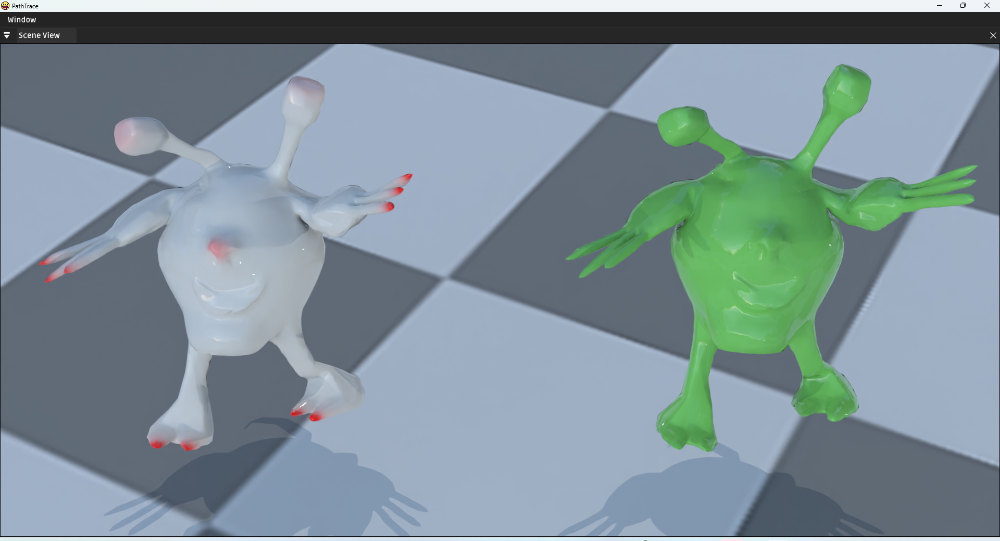

 2**.acquired by by Raster**

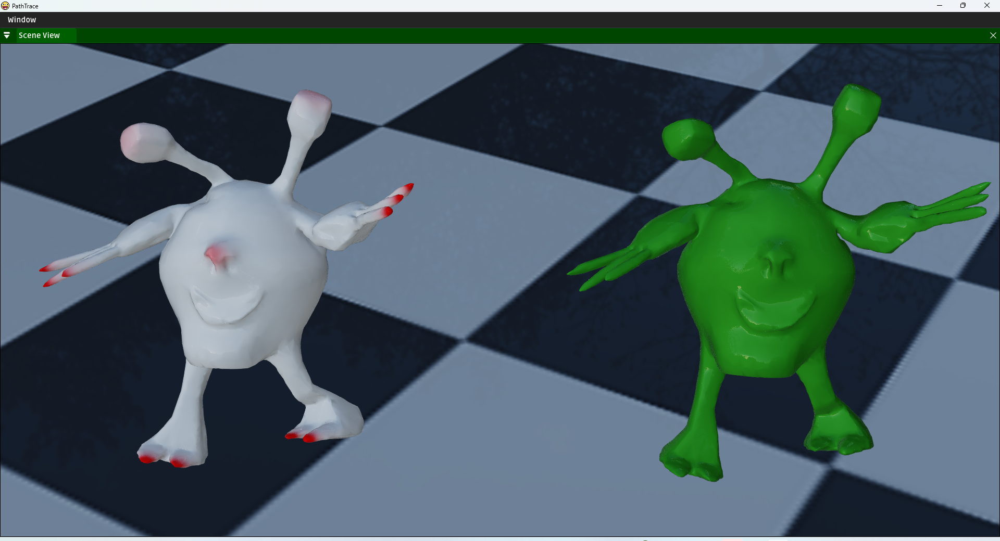


## Fluid simulation

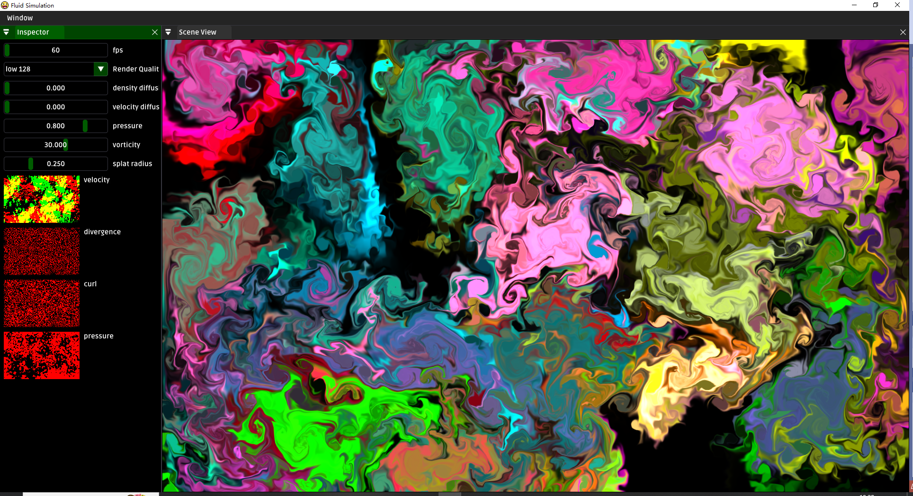

## Particle With Trail

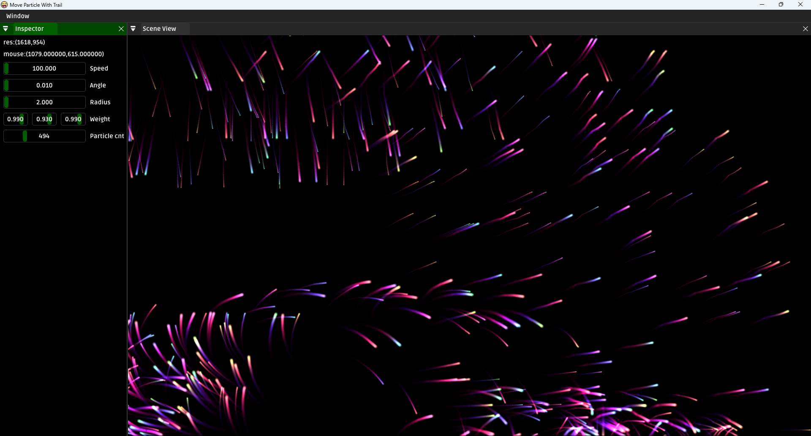

## tiled forward renderer

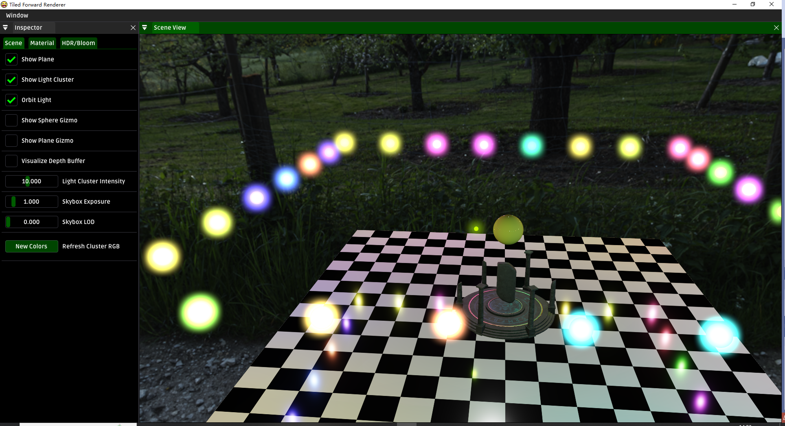

## environment lighting (IBL)

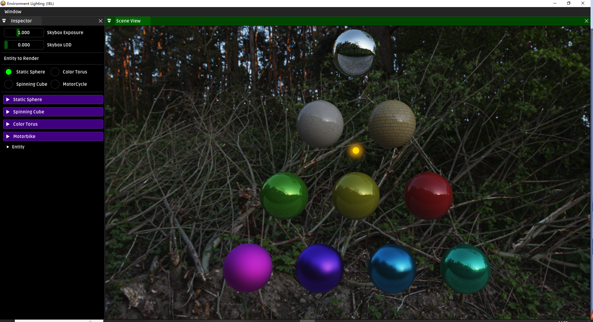

## disney principled BSDF

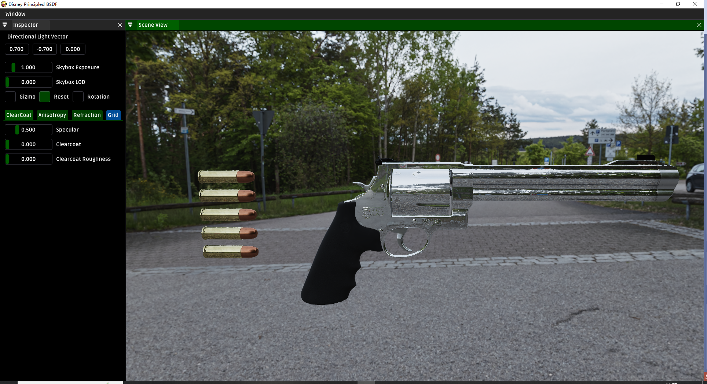

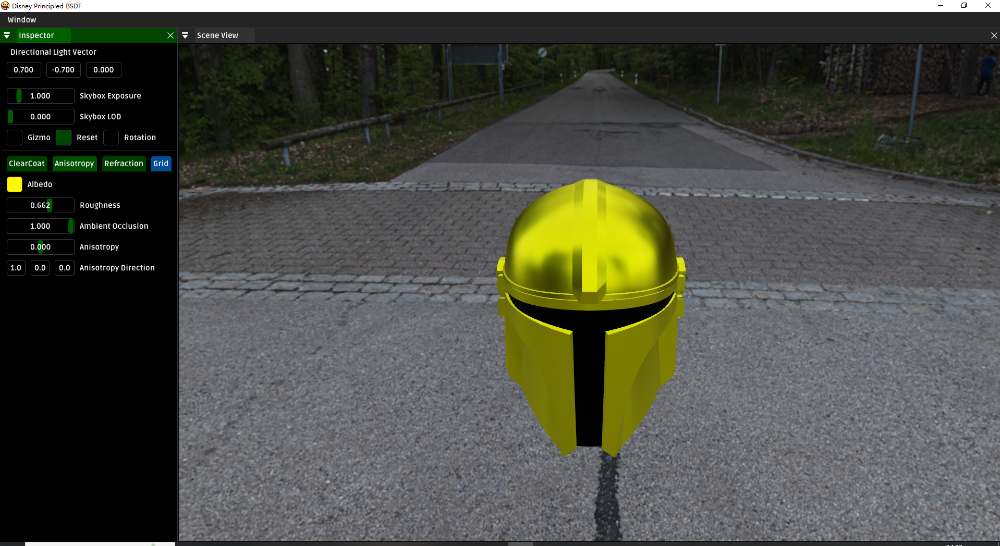

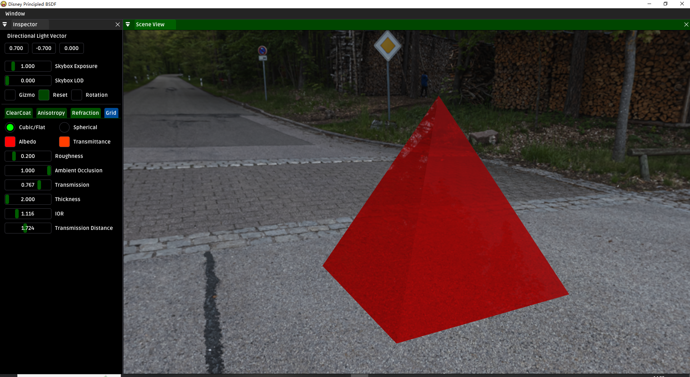

## Skeleton Animation

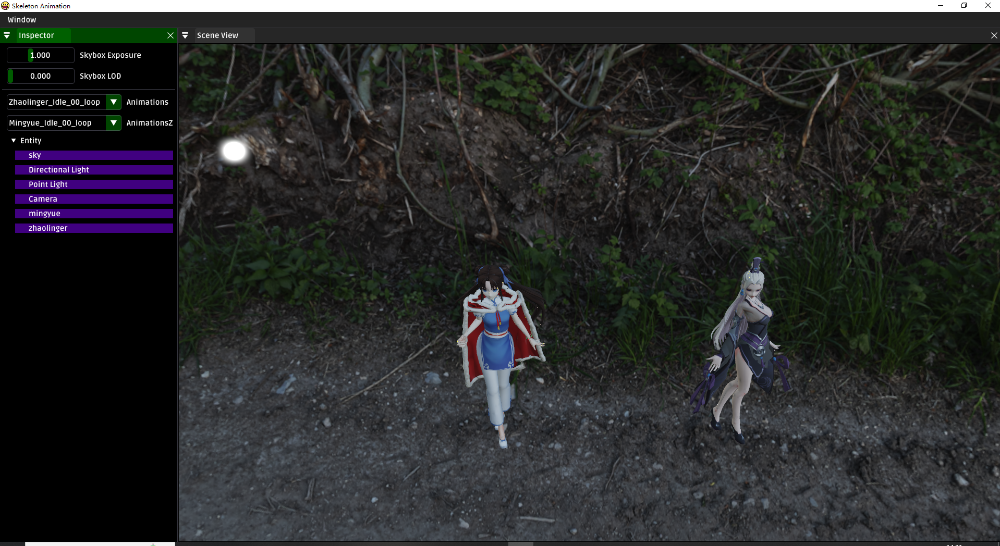

## PCSS Shadow and Animation

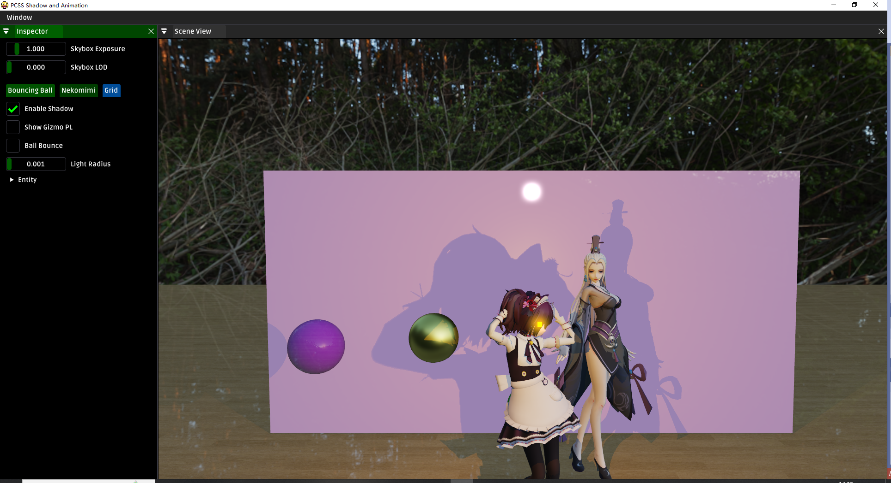

## SHADOW MAP PCF PCSS VSM

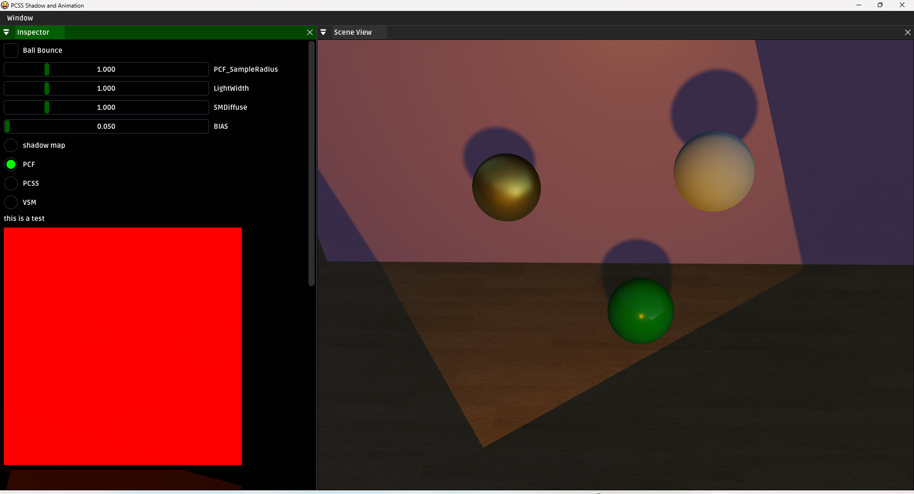

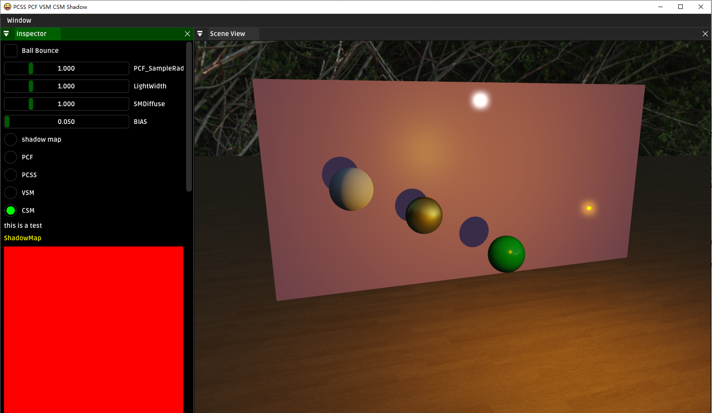


## Bloom

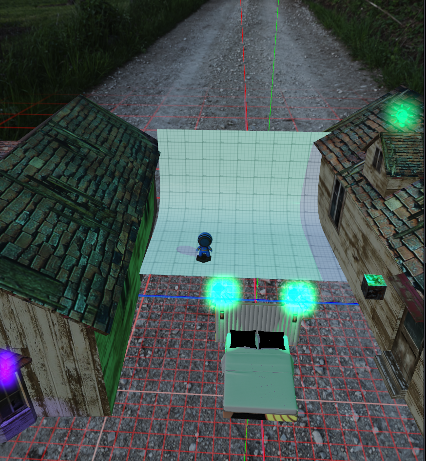

