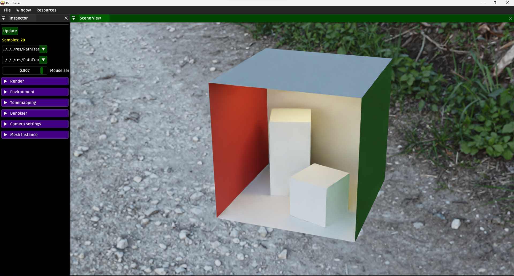
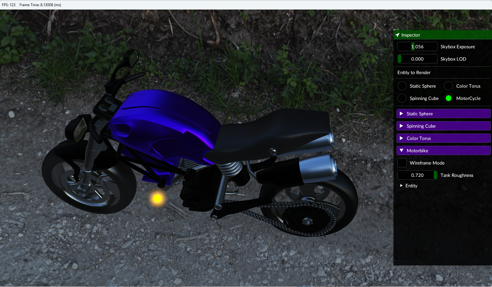
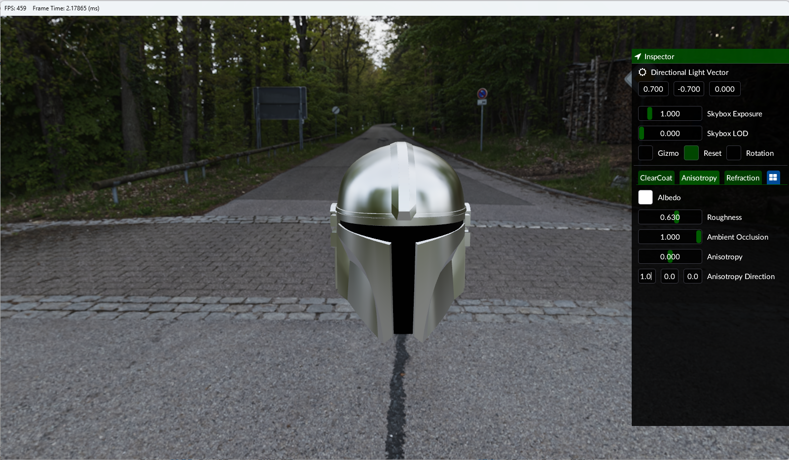
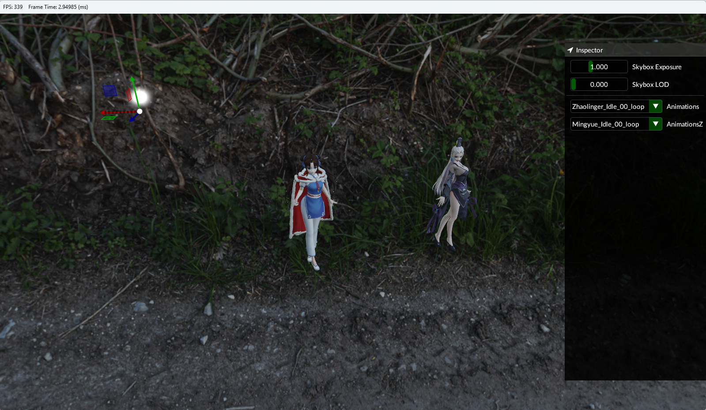
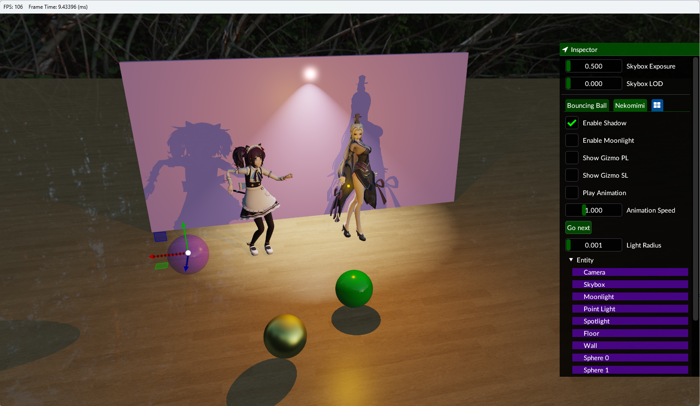
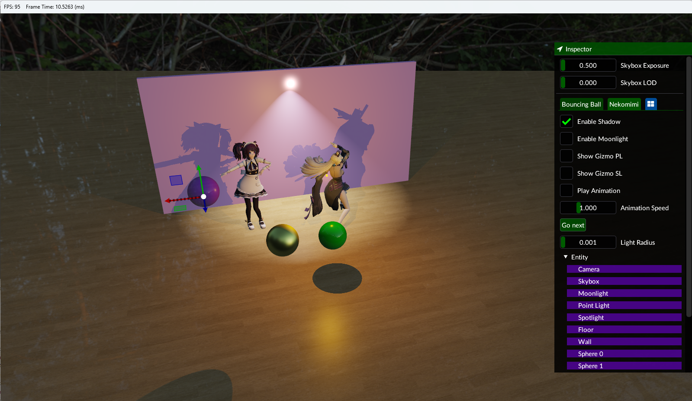

# opengl renderer

This is a simple renderer built with OpenGL 4.6 and C++17 

Watch [demo](https://www.bilibili.com/video/BV18Y4y1973W/) on bilibili

## How to build (Windows only)

- Visual Studio 2019
- Windows 10/11 with OpenGl4.6 support
- Cmake

```
git clone https://github.com/271812697/opengl.git
cd opengl/
mkdir Build
cd Build/
cmake ..
```

## Screenshots















## 
