# 简介

**This is my work for learning graphics rendering**

Link:https://github.com/271812697/opengl

 Watch Video demo :https://www.bilibili.com/video/BV1Dw411e7aa/?vd_source=7975919d79e304e89435052729a5f4d9

### What **Features in my work**

1. Skeleton animation
2. PBR IBL Lighting 
3. Shadow map pcf pcss vsm csm
4. Path tracing 
5. 2D Fluid Simulation
6. Tile Based Forward Rendering
7. Post Process
8. Engine Editor
9. GLTF Viewer
10. Polygon Demo for D5 D5 school recruitment
11. DX 11 Renderer for Visualization of experimental results of the paper 

## How to build 

- Visual Studio 2019 or greater
- Windows 10/11 with OpenGl4.6 support
- Cmake

```
git clone https://github.com/271812697/opengl.git
cd opengl/
mkdir Build
cd Build/
cmake ..
```

# Screenshots

## **Render the Scene By path Tracing or Forward**

1.**Path Tracing**


 2**.****Forward Rendering******


## Fluid simulation


## Particle With Trail


## tiled forward renderer


## environment lighting (IBL)


## disney principled BSDF


## Skeleton Animation


## PCSS Shadow and Animation


## SHADOW MAP PCF PCSS VSM


## gltf Viewer

###  from Sketch fab

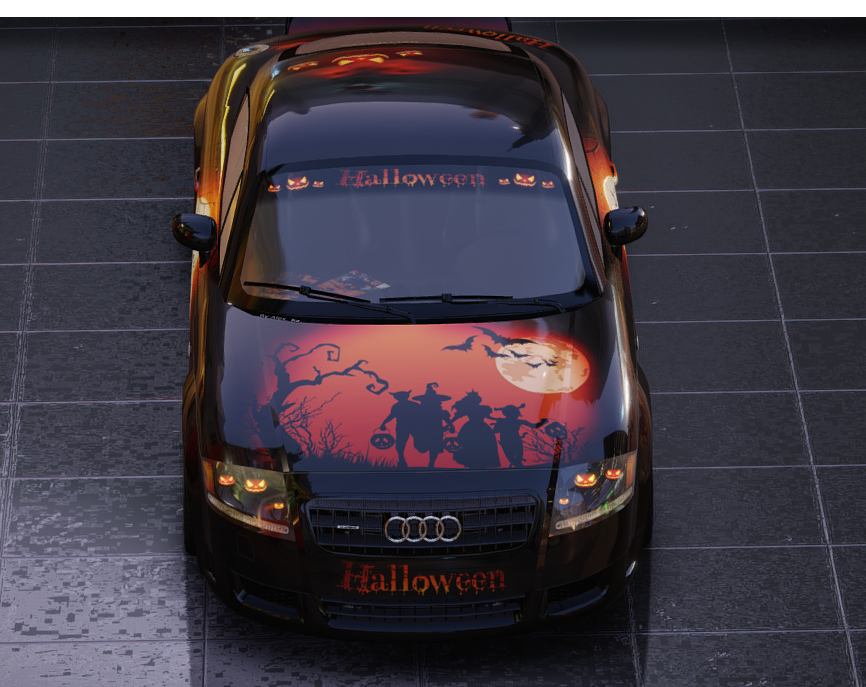

### from my work by Path Tracing

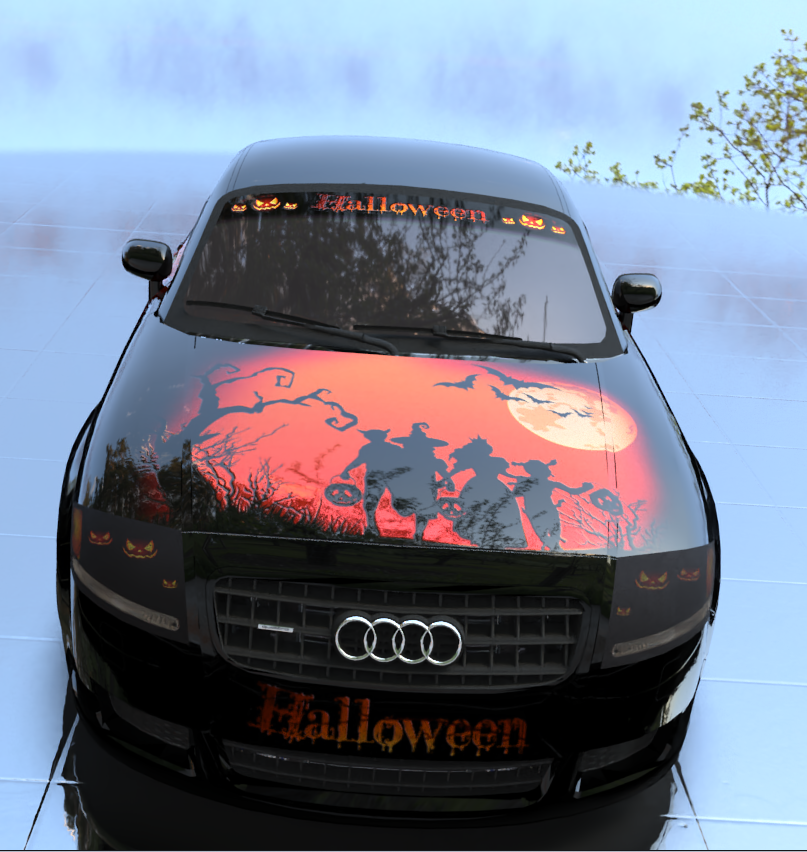

### from my work by forward render

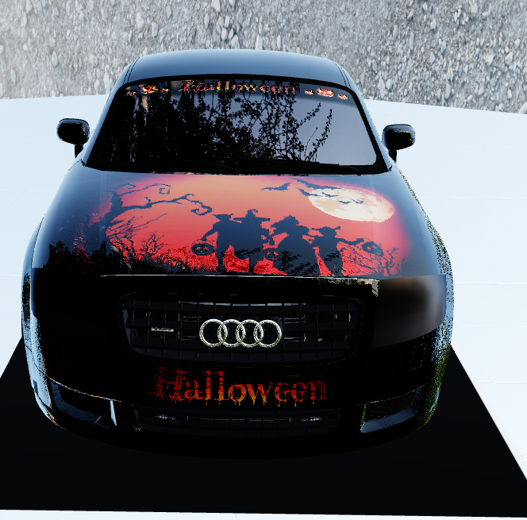

## DX11

### **Purpose**&&background

这个渲染器是为了可视化三维模型兴趣点检测的实验结果而编写的，因为是采用图形API DX编写的因此自由度非常高，实现了非常多的自定义效果, 而不必受限于成熟引擎。最开始本人是在unity 上实现了这一套实验结果可视化流程,但是unity必须在它的既有框架下去编写代码，并且在一些自定义效果实现上支持不好，后面就转投DX去实现。

**三维兴趣点检测**：

三维模型兴趣点检测是在三维模型上检测出一类特殊的顶点，这类特殊顶点通常对应于三维模型上具有特殊语义的部位。

**论文PipeLine**


**Ground Truth and Learned**:

三维模型上每一个顶点预测兴趣点相对该顶点的球面坐标和置信度

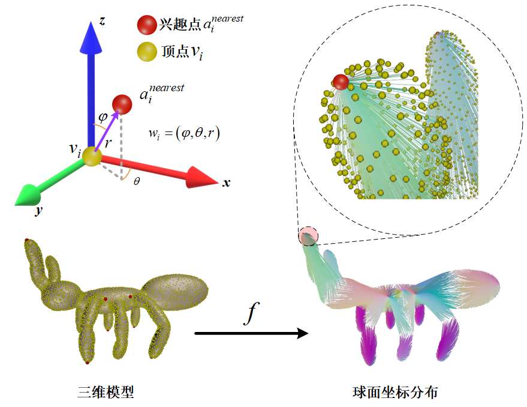

**example show:**

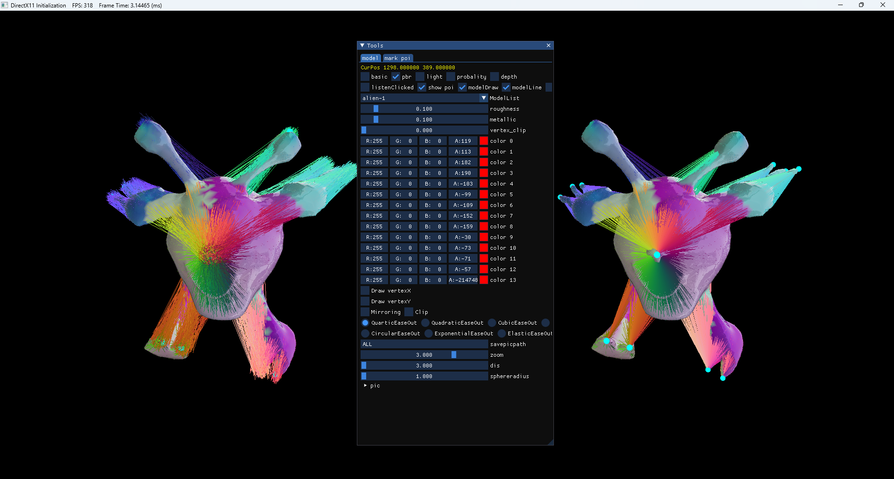

### 功能界面:

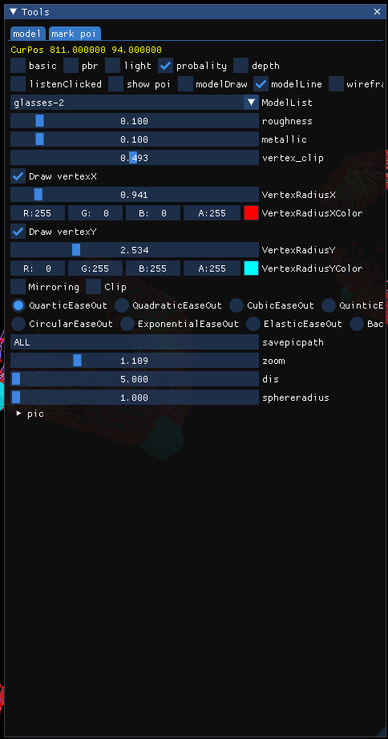

### 可视化功能

提供了对三维模型兴趣点检测的可视化,用来可视化论文实验的结果并与Ground Truth对比：

1. 可以查看三维模型的概率分布
2. 兴趣点球面坐标分布
3. 点云绘制
4. pbr+IBL渲染、phong渲染、深度模式、线框模式
5. 自定义的线框绘制
6. 提供论文实验结果中间结果分析
7. 截屏保存可视化结果
8. 可视化标注模型的兴趣点制作数据集

#### 概率分布

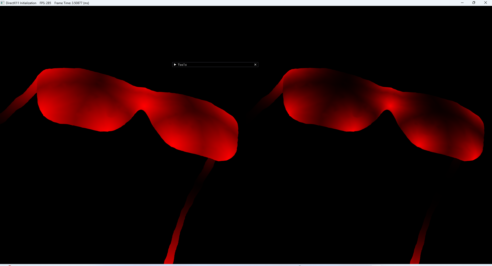

#### 兴趣点球面坐标分布

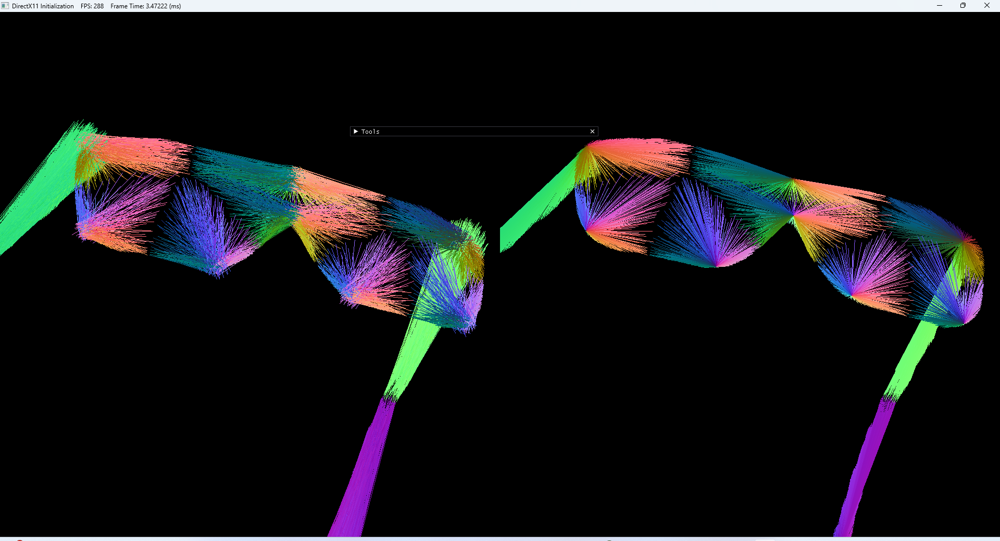

#### 查看三维模型的兴趣点预测结果:

左边为方法预测，右边为ground truth

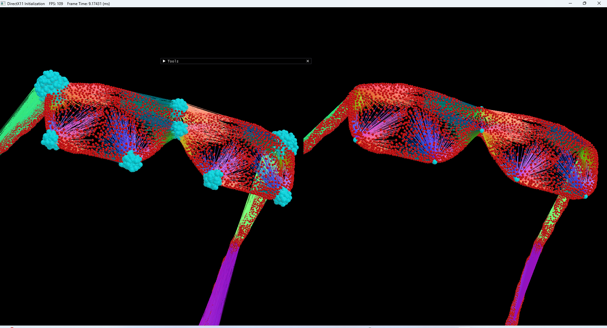


#### 点云绘制

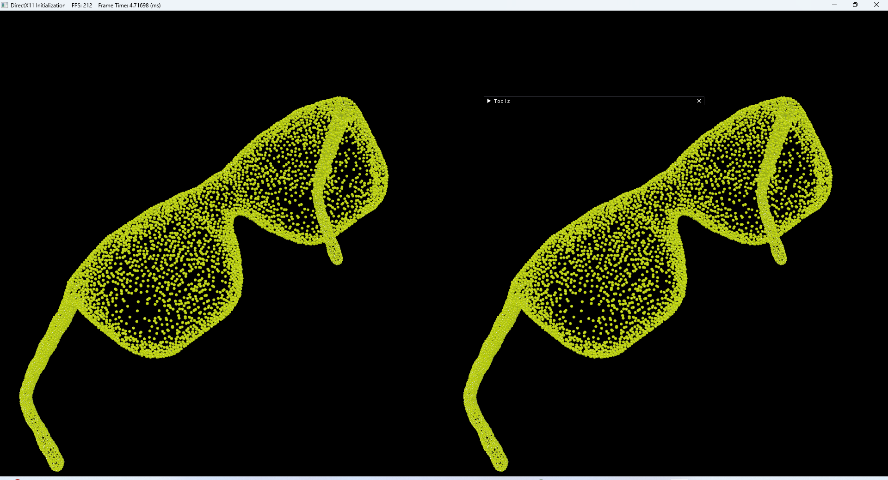

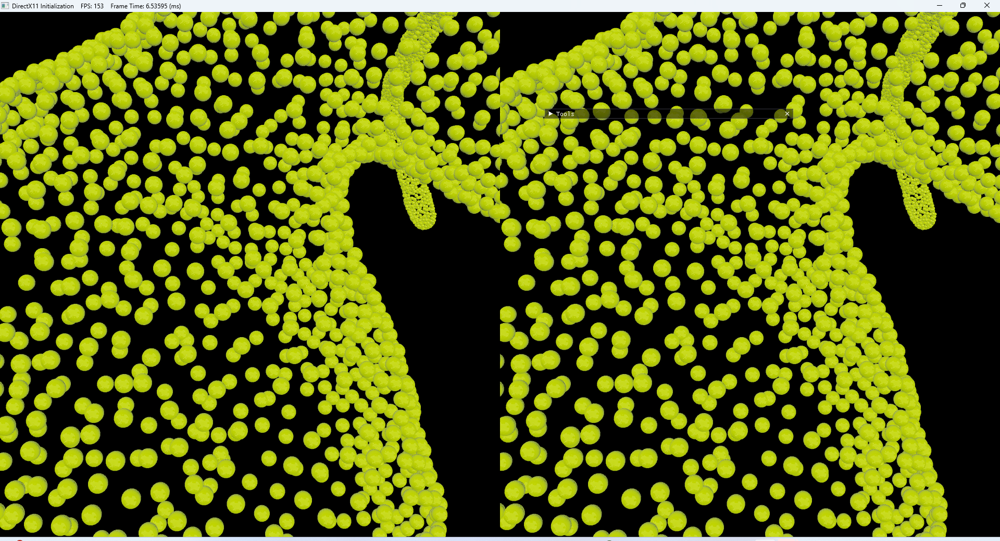

#### pbr+IBL渲染、phong渲染、深度模式、线框模式

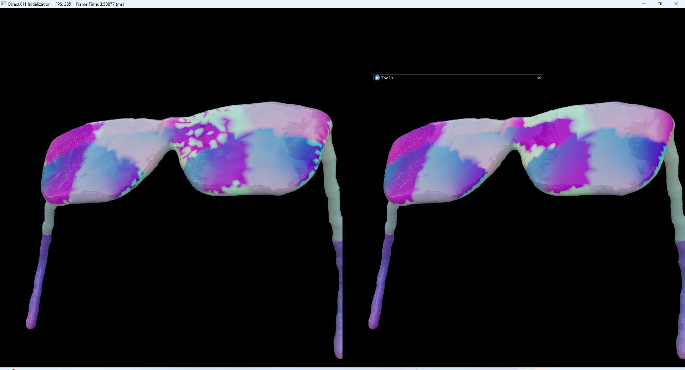

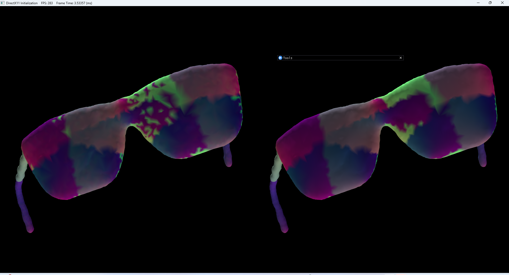

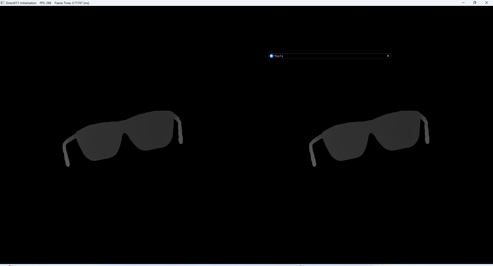

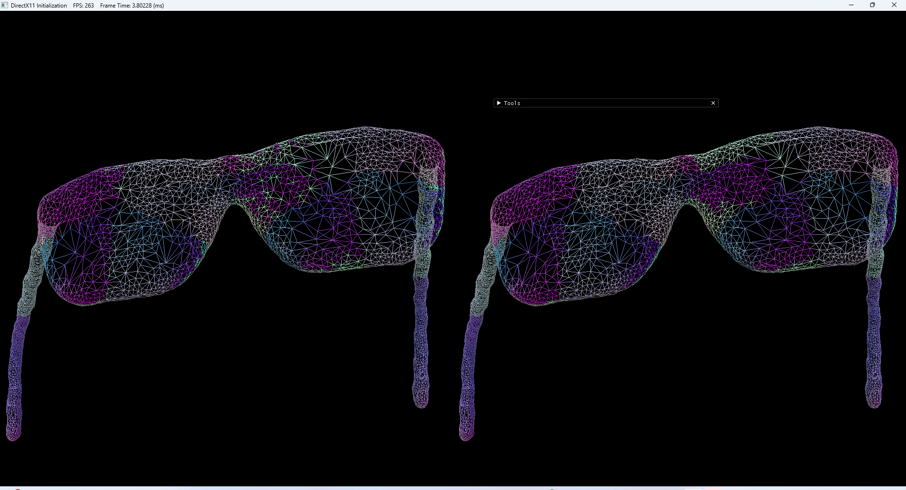

#### 截屏


#### 标注模型

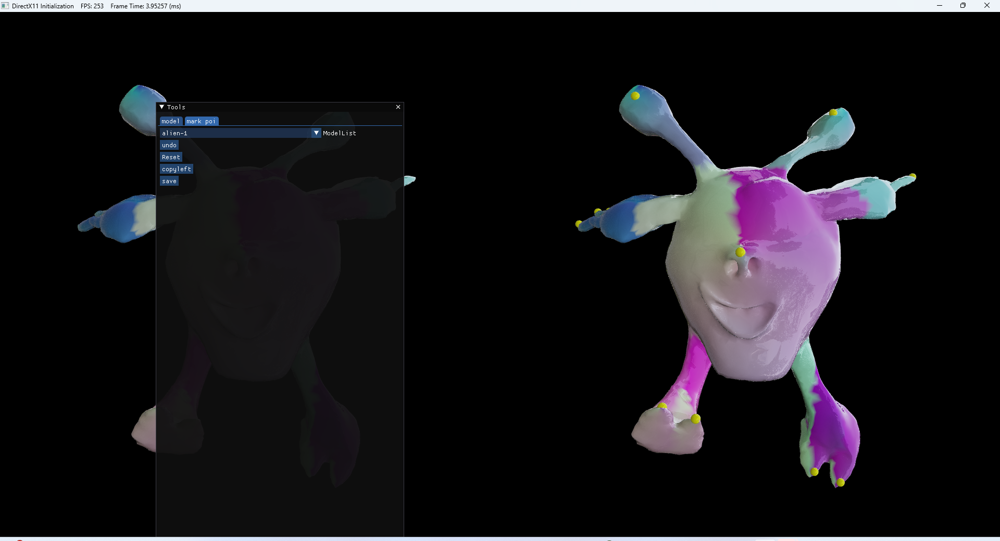

