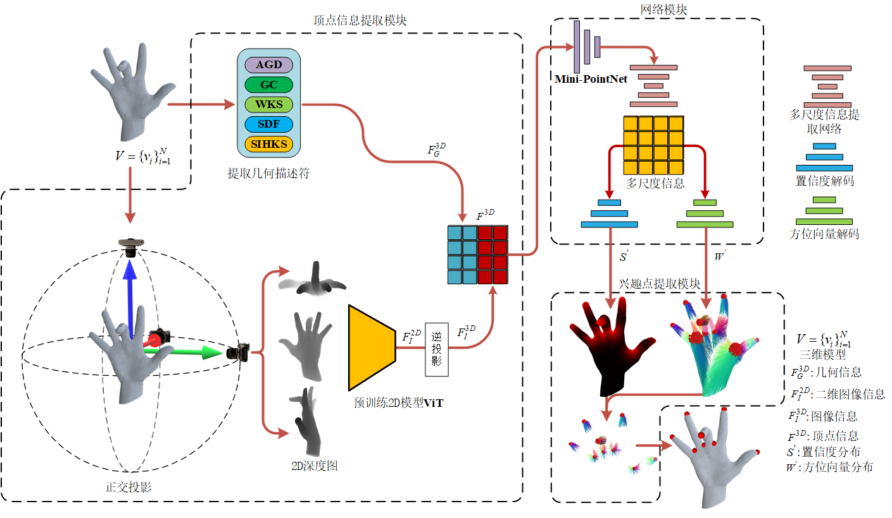
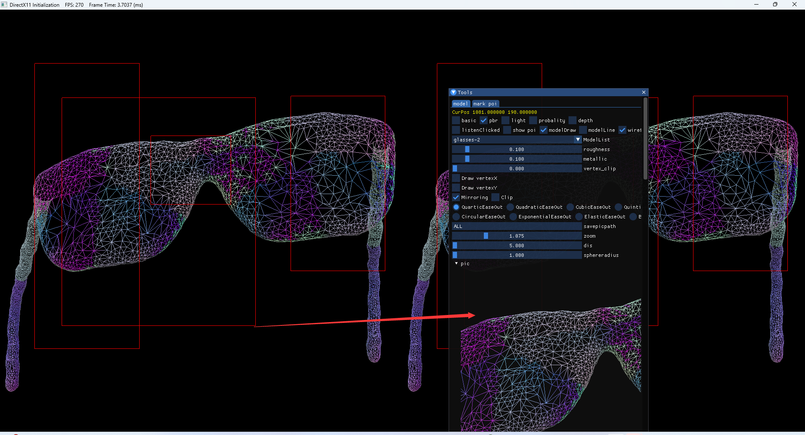

# 简介

**This is my work for learning graphics rendering**

Link:https://github.com/271812697/opengl

 Watch Video demo :https://www.bilibili.com/video/BV1Dw411e7aa/?vd_source=7975919d79e304e89435052729a5f4d9

### What **Features in my work**

1. Skeleton animation
2. PBR IBL Lighting 
3. Shadow map pcf pcss vsm csm
4. Path tracing 
5. 2D Fluid Simulation
6. Tile Based Forward Rendering
7. Post Process
8. Engine Editor
9. GLTF Viewer
10. Polygon Demo for D5 D5 school recruitment
11. DX 11 Renderer for Visualization of experimental results of the paper 

## How to build 

- Visual Studio 2019 or greater
- Windows 10/11 with OpenGl4.6 support
- Cmake

```
git clone https://github.com/271812697/opengl.git
cd opengl/
mkdir Build
cd Build/
cmake ..
```

# Screenshots

## **Render the Scene By path Tracing or Forward**

1.**Path Tracing**


 2**.****Forward Rendering******


## Fluid simulation


## Particle With Trail


## tiled forward renderer


## environment lighting (IBL)


## disney principled BSDF


## Skeleton Animation


## PCSS Shadow and Animation


## SHADOW MAP PCF PCSS VSM


## gltf Viewer

###  from Sketch fab


### from my work by Path Tracing


### from my work by forward render


## DX11

### **Purpose**&&background

这个渲染器是为了可视化三维模型兴趣点检测的实验结果而编写的，因为是采用图形API DX编写的因此自由度非常高，实现了非常多的自定义效果, 而不必受限于成熟引擎。最开始本人是在unity 上实现了这一套实验结果可视化流程,但是unity必须在它的既有框架下去编写代码，并且在一些自定义效果实现上支持不好，后面就转投DX去实现。

**三维兴趣点检测**：

三维模型兴趣点检测是在三维模型上检测出一类特殊的顶点，这类特殊顶点通常对应于三维模型上具有特殊语义的部位。

**论文PipeLine**



**Ground Truth and Learned**:

三维模型上每一个顶点预测兴趣点相对该顶点的球面坐标和置信度


**example show:**


### 功能界面:


### 可视化功能

提供了对三维模型兴趣点检测的可视化,用来可视化论文实验的结果并与Ground Truth对比：

1. 可以查看三维模型的概率分布
2. 兴趣点球面坐标分布
3. 点云绘制
4. pbr+IBL渲染、phong渲染、深度模式、线框模式
5. 自定义的线框绘制
6. 提供论文实验结果中间结果分析
7. 截屏保存可视化结果
8. 可视化标注模型的兴趣点制作数据集

#### 概率分布


#### 兴趣点球面坐标分布


#### 查看三维模型的兴趣点预测结果:

左边为方法预测，右边为ground truth


#### 点云绘制


#### pbr+IBL渲染、phong渲染、深度模式、线框模式


#### 截屏



#### 标注模型


# Polygon Demo

## 2D 空间内曲面的相交判定

1. 设计一个函数，用于判断 2D 空间内的两个任意多边形是否有重叠，并返回重叠的区域。可以自由设计表示多边形的数据结构。
2. (optional) 基于小问 1 给出的函数，如果在 2D 空间内有大量的多边形，如何快速判断它们是否有重叠？请给出你的设计思路和算法。

## 回答

1. 实现了2D空间中两个任意多边形的求交集的算法
2. 使用Dynamic Tree来划分管理2D空间，Dynamic Tree构建在多边形的轴对齐包围盒AABB上。 当2D空间中有大量多边形时，能够使用加速结构快速判断多边形是否与其他多边形相交，并给出相交区域。

## **算法结果：**

针对问题1、2给出了自己的算法结果如下：

## **任意两个2D多边形求交：**


## **使用Dynamic Tree加速求交：**


## 算法的核心实现

### 数据结构的定义：

主要使用六个源码文件定义了以下数据结构：


2D空间中的顶点与向量Vertex、Vec2：


线段LineSegment：


任意多边形Polygon：


轴对齐包围盒AABB：


### 求交算法

如下展示了，本文实现两个任意多边形相交算法的可视化结果


#### 两个任意多边形求交算法：

原型

```c++
bool IntersectionPolygons(struct Polygon& polygon1, struct Polygon& polygon2, std::vector<struct Polygon>&ans)
```


其思路为：


#### 凹多边形分割算法：

如图对多边形分割，先找到凹陷的地方，再进行分割


基本过程为：

1. 顺着多边形的边进行遍历，
2. 利用叉积来判断两条边的夹角，若大于180度则以这条边切割多边形，
3. 对得到的两个新的多边形递归分割，汇总结果

算法实现

```c++
/*
* 将凹多边形分割成凸多边形
* 先检查是否是凹多边形，若是则进行分割操作
*/
std::vector<std::vector<Vertex>> DividePolygonIfConcave(std::vector<Vertex> _points, bool _antiClockwise);

```


#### 两个凸多边形求交算法：

基本过程为：

1. 收集两个多边形的边的交点
2. 收集包含在另一个多边形内部的顶点
3. 顶点排序，返回交集

```c++
std::vector<Vertex> IntersectionPolygon(struct Polygon polygon1, struct Polygon polygon2);
```


边求交：

两条线段利用叉积来判断是否相交，若相交根据数学公式算出交点

```c++
std::vector<Vertex> IntersectionLine(LineSegment line1, LineSegment line2);
```


判断顶点是否在多边形内部：

利用点射法，从顶点引一条射线，判断这条射线与多边形的边的交点个数。

1. 奇数在多边形内部
2. 偶数在多边形外部

```c++
bool VertexInPolygon(Vertex v, std::vector<LineSegment>lines);
```


顶点排序：

1. 算出所有顶点的几何中心
2. 按照顶点与几何轴心构成的夹角大小来排序

```c++
/*
* 判断顶点a、b分别与center构成的夹角
*/

bool VertexCmp(const Vertex& a, const Vertex& b, const Vertex& center) {

    //向量OA和向量OB的叉积
    int det = (a.x - center.x) * (b.y - center.y) - (b.x - center.x) * (a.y - center.y);
    float angle_a = atan2(a.y - center.y, a.x - center.x);
    float angle_b = atan2(b.y - center.y, b.x - center.x);
    return angle_a < angle_b;
}
```

### Dynamic Tree


类似于BVH树，Dynamic Tree使用树形结构的方式管理了2D空间，多边形将自己的轴对齐包围盒交AABB给Dynamic Tree, Dynamic Tree为所有的轴对齐包围盒构建一颗平衡二叉树，从而降低了多边形在场景中查找与其相交的多边形的复杂度。

如下图，是本人实现的一个Dynamic Tree管理2D空间的可视化展示。


当一个2D场景中有大量的多边形时(假设为n个)，对于一个多边形要在场景中找出与其相交的多边形时：

**1.顺序查找**

当不使用加速结构去管理空间，需要顺序查找每一个多边形并与其求交，平均复杂度为：
$$
% MathType!MTEF!2!1!+-
% feaahqart1ev3aaatCvAUfeBSjuyZL2yd9gzLbvyNv2CaerbuLwBLn
% hiov2DGi1BTfMBaeXatLxBI9gBaerbd9wDYLwzYbItLDharqqtubsr
% 4rNCHbWexLMBbXgBd9gzLbvyNv2CaeHbl7mZLdGeaGqipCI8Ffeu0d
% Xdh9vqqj-hEeeu0xXdbba9frFj0-OqFfea0dXdd9vqaq-JfrVkFHe9
% pgea0dXdar-Jb9hs0dXdbPYxe9vr0-vr0-vqpWqabeaabiqaceaaca
% qabeaadaqaaqaafaGcbaGaae4taiaacIcacaWGUbGaaiykaiabgEna
% 0kaabMeacaqGUbGaaeiDaiaabwgacaqGYbGaae4CaiaabwgacaqGJb
% GaaeiDaiaabMgacaqGVbGaaeOBaiaabIcacaqGPaaaaa!50D5!
{\rm{O}}(n) \times {\rm{Intersection}}
$$
其中Intersection为多边形的求交操作的复杂度

**2.使用Dynamic Tree**

当使用Dynamic Tree时，Dynamic用平衡二叉树对2D空间进行了划分，2D空间中每一个多边形通过其AABB注册到Dynamic Tree上成为叶节点。

多边形的求交操作就是对平衡二叉树进行查找的过程，查找从根节点开始进行遍历：

1. **若当前遍历的节点是叶节点，则与叶节点所管理的多边形进行求交操作，若不是叶节点则执行2、3**
2. **若多边形的AABB与当前节点的AABB不相交，则终止查找，省去了与这个节点AABB所管理的所有多边形的查找操作**
3. **若多边形的AABB与当前节点的AABB相交,则继续到，左右子树上查找，递归重复这个过程**

时间复杂度为：
$$
% MathType!MTEF!2!1!+-
% feaahqart1ev3aaatCvAUfeBSjuyZL2yd9gzLbvyNv2CaerbuLwBLn
% hiov2DGi1BTfMBaeXatLxBI9gBaerbd9wDYLwzYbItLDharqqtubsr
% 4rNCHbWexLMBbXgBd9gzLbvyNv2CaeHbl7mZLdGeaGqipCI8Ffeu0d
% Xdh9vqqj-hEeeu0xXdbba9frFj0-OqFfea0dXdd9vqaq-JfrVkFHe9
% pgea0dXdar-Jb9hs0dXdbPYxe9vr0-vr0-vqpWqabeaabiqaceaaca
% qabeaadaqaaqaafaGcbaGaciiBaiaac+gacaGGNbGaaiikaiaaikda
% caWGUbGaeyOeI0IaaGymaiaacMcacqGHxdaTcaqGjbGaaeOBaiaabs
% hacaqGLbGaaeOCaiaabohacaqGLbGaae4yaiaabshacaqGPbGaae4B
% aiaab6gacaqGOaGaaeykaaaa!5537!
\log (2n - 1) \times {\rm{Intersection}}
$$
其中2n-1代表平衡二叉树的节点的数目，所有的多边形都用叶节点来管理，叶节点有n个，每一个非叶节点有两个孩子节点，故而节点总数目为2n-1。


#### 数据结构

节点定义：


树的定义：


#### 管理2D多边形,加速求交：

使用示例如下:


##### 注册多边形到Dynamic Tree中：

首先从节点数组中分配一个空闲节点，填入相应的代理信息，然后使用插入操作，插入到平衡二叉树中


##### 插入叶子节点：


##### 求交操作：


